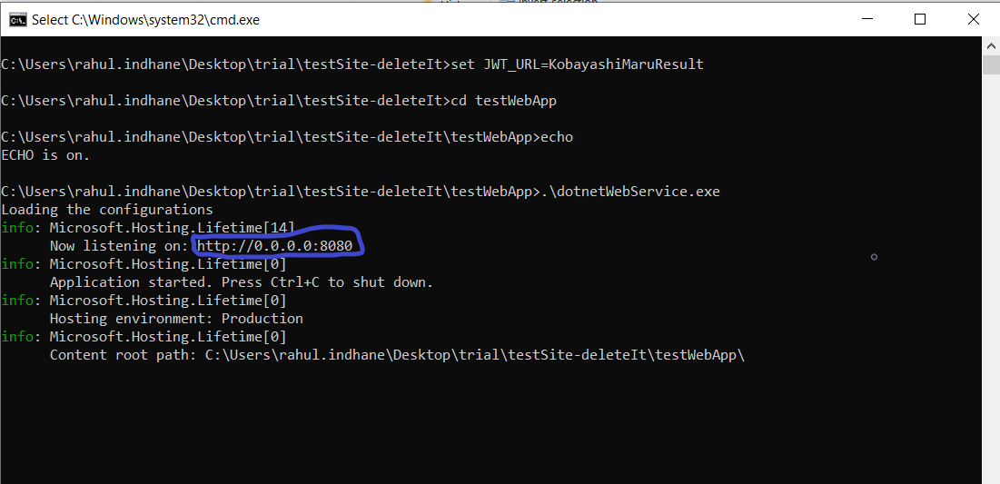
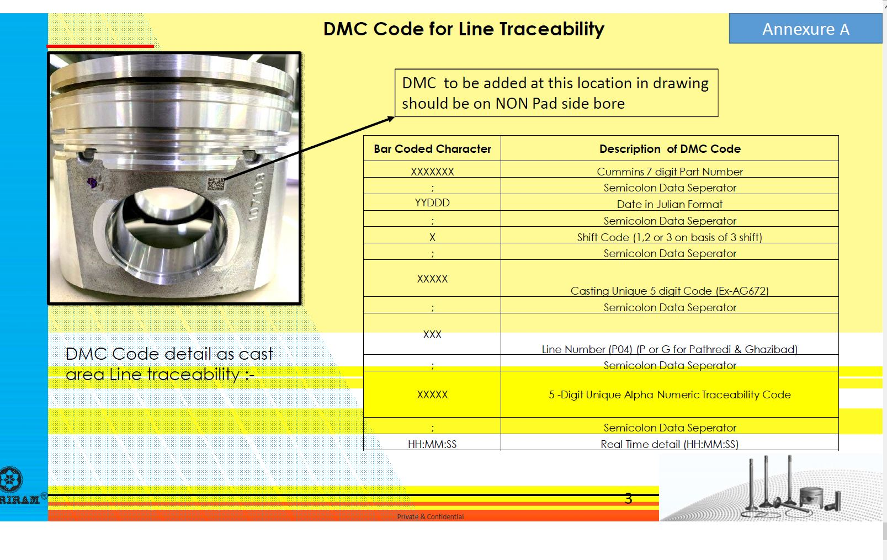

## Instructions to initiate the test Traceability Web-Screen
- First unzip the  `testWebApp.zip` and extract its content
- Go within the unzipped folder , run the startup script by double clicking on it, to run the test server. The name of the script is `StartUpScript.cmd`
- Check the listening port of the server as indicated in the sprung-up terminal. Refer the below image to see an example of running server's listening port. To manage listening port follow instruction at `Handling the listening port`
-     
- To go to the Part traceability screen, type in address: `http://localhost:port/`  within the url-bar of your browser
- For eg: if listening port is `5500` then type-in as `http://localhost:5500`
- Now you should be able to see the traceability screen on your browser

## Scan code test procedure 
- The scanner input field only accepts the DMC code as PO annexure A. The annexure is shown below: 
-   
- Currently only following data points have been configured in the test server. 
    - **1234567;07365;3;AG672;G04;P4567;07:09:26** 
    - **1236789;11111;1;ABCDE;p01;A1234;22:03:06** 
    - **1236789;11111;1;ABCDG;p01;A1234;22:03:06** 
- For more data points in the test,  fill additional `jsonObject` string within the file `DataStorage\data.json`
- Scan code are case-insensitively validated and checked on server end

### Handling the listening port : 
- Default port is 8080, but use the listenning port as indicated in the terminal
- To change the port, edit the property-value `AppPort-http` within the file `ServerConfig.json` to change the listening port 
- If listening port is changed. restart the test server using the startup script